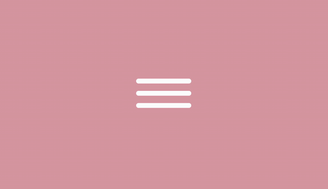
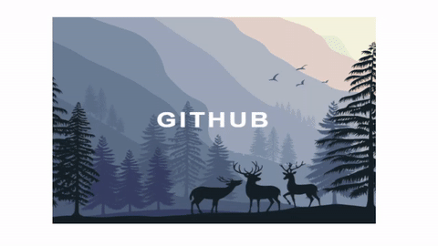
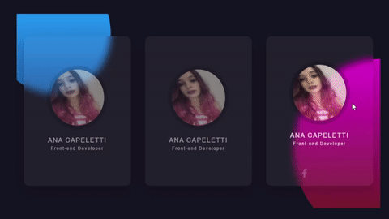
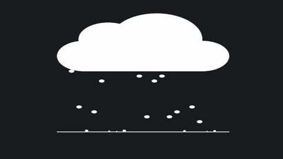
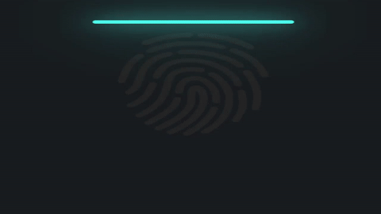
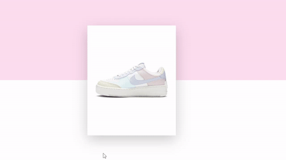
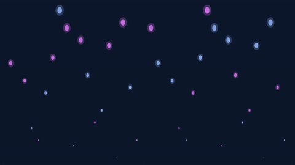
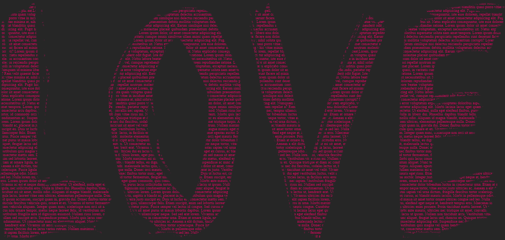
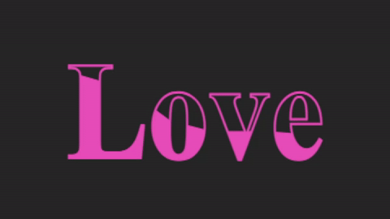

# 30diasDeCSS 👩🏻‍💻

 30 dias de CSS3, é um desafio que visa ajudá-lo a melhorar suas habilidades de codificação fazendo mini projetos diários utilizando HTML5 e CSS3

# Regras gerais

* Realizar 30 mini projetos (para mim, por 30 dias seguidos);
* Compartilhar o progresso nas mídias sociais (Twitter, Facebook, Linkedin etc.) usando a hashtag #30diasDeCSS;
* O projeto deve ser concluído até 23:59.

Gostou da ideia? 
[Clique aqui](https://github.com/MilenaCarecho/30diasDeCSS/issues/1) para participar

## Referêcias dos desafios
[Online Tutorials](https://www.youtube.com/c/OnlineTutorials4Designers), [Milena Carecho](https://github.com/MilenaCarecho) e [Gabriela Pinheiro](https://github.com/SpruceGabriela).

## Sumário
* [Dia 01 - Indicador de chat](#day01)
* [Dia 02 - Ícone para menu hamburguer](#day02)
* [Dia 03 - Imagem com efeito hover](#day03)
* [Dia 04 - Cartão transparente](#day04)
* [Dia 05 - Lightning text](#day05)
* [Dia 06 - Bubble Menu](#day06)
* [Dia 07 - Rainy Cloud](#day07)
* [Dia 08 - Scanning Finger Print](#day08)
* [Dia 09 - Jumping Text](#day09)
* [Dia 10 - Shoe](#day10)
* [Dia 11 - Mouse move Effects](#day11)
* [Dia 12 - Animated Background](#day12)
* [Dia 13 - Text Portrait Effects](#day13)
* [Dia 14 - Water Wave Text Animation](#day14)

##  Desafio dia 01 - Indicador de chat (digitando...) 

  

Para verificar o meu projeto [clique aqui](https://github.com/ANACAPELETTI/Indicador_Chat).

##  Desafio dia 02 - Ícone para menu hamburguer 

  

Para verificar o meu projeto [clique aqui](https://github.com/ANACAPELETTI/30diasDeCSS/tree/main/projects/day_2).

##  Desafio dia 03 - Imagem com efeito hover 

  

Para verificar o meu projeto [clique aqui](https://github.com/ANACAPELETTI/30diasDeCSS/tree/main/projects/day_3).

##  Desafio dia 04 - Imagem com efeito hover 

  

Para verificar o meu projeto [clique aqui](https://github.com/ANACAPELETTI/30diasDeCSS/tree/main/projects/day_4).

##  Desafio dia 05 - Lightning text 

  

Para verificar o meu projeto [clique aqui](https://github.com/ANACAPELETTI/30diasDeCSS/tree/main/projects/day_5).

##  Desafio dia 06 - Bubble menu 

  

Para verificar o meu projeto [clique aqui](https://github.com/ANACAPELETTI/30diasDeCSS/tree/main/projects/day_6).

##  Desafio dia 07 - Rainy cloud 

  

Para verificar o meu projeto [clique aqui](https://github.com/ANACAPELETTI/30diasDeCSS/tree/main/projects/day_7).

##  Desafio dia 08 - Scanning Finger Print 

  

Para verificar o meu projeto [clique aqui](https://github.com/ANACAPELETTI/30diasDeCSS/tree/main/projects/day_8).

##  Desafio dia 09 - Jumping Text 

  

Para verificar o meu projeto [clique aqui](https://github.com/ANACAPELETTI/30diasDeCSS/tree/main/projects/day_9).

##  Desafio dia 10 - Shoe 

  

Para verificar o meu projeto [clique aqui](https://github.com/ANACAPELETTI/30diasDeCSS/tree/main/projects/day_10).

##  Desafio dia 11 - Mouse move Effects 

  

Para verificar o meu projeto [clique aqui](https://github.com/ANACAPELETTI/30diasDeCSS/tree/main/projects/day_11). 

##  Desafio dia 12 - Animated Background 

  

Para verificar o meu projeto [clique aqui](https://github.com/ANACAPELETTI/30diasDeCSS/tree/main/projects/day_12). 

##  Desafio dia 13 - Text Portrait Effects 

  

Para verificar o meu projeto [clique aqui](https://github.com/ANACAPELETTI/30diasDeCSS/tree/main/projects/day_13). 

##  Desafio dia 14 - Water Wave Text Animation 

  

Para verificar o meu projeto [clique aqui](https://github.com/ANACAPELETTI/30diasDeCSS/tree/main/projects/day_14). 

