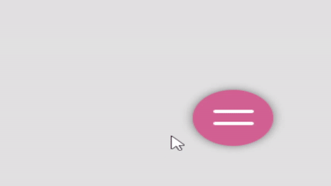
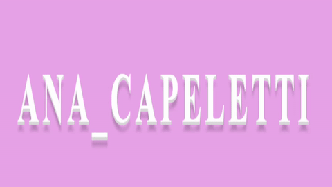

# 30diasDeCSS 👩🏻‍💻

 30 days of CSS3, is a challenge that aims to help you improve your coding skills by doing mini daily projects using HTML5 and CSS3
 
# General rules

* Do 30 mini projects (for me, not necessarily 30 days in a row);
* Share progress on social media (Twitter, Facebook, Linkedin etc.) using the hashtag #30daysDeCSS;
* The project must be completed by 11:59 PM.

Like the idea?
[Click here](https://github.com/MilenaCarecho/30diasDeCSS/issues/1) to join.

## Challenge references
[Online Tutorials](https://www.youtube.com/c/OnlineTutorials4Designers), [Milena Carecho](https://github.com/MilenaCarecho) and [Gabriela Pinheiro](https://github.com/SpruceGabriela).

## Summary
* [Day 01 - Chat Indicator](#day01)
* [Day 02 - Burger Menu Icon](#day02)
* [Day 03 - Image With Hover effect](#day03)
* [Day 04 - Transparent Card](#day04)
* [Day 05 - Lightning Text](#day05)
* [Day 06 - Bubble Menu](#day06)
* [Day 07 - Rainy Cloud](#day07)
* [Day 08 - Scanning Finger Print](#day08)
* [Day 09 - Jumping Text](#day09)
* [Day 10 - Shoe](#day10)
* [Day 11 - Mouse Move Effects](#day11)
* [Day 12 - Animated Background](#day12)
* [Day 13 - Text Portrait Effects](#day13)
* [Day 14 - Water Wave Text Animation](#day14)
* [Day 15 - Hexagonal Icon Hover](#day15)
* [Day 16 - Smooth Scrolling To A DIV](#day16)
* [Day 17 - Break](#day17)
* [Day 18 - Icon Background Animation](#day18)
* [Day 19 - Button Hover Effects](#day19)
* [Day 20 - Box Shadow Loading Animation](#day20)
* [Day 21 - 2023 | Happy new year](#day21)
* [Day 22 - Wave Background](#day22)
* [Day 23 - Keyboard Keys](#day23)
* [Day 24 - CSS Text Hover Effects](#day24)
* [Day 25 - Animated Circular Progress Bar](#day25)
* [Day 26 - Liquid Loader](#day26)
* [Day 27 - Crime Scene](#day27)
* [Day 28 - Wavy Div Animation](#day28)
* [Day 29 - Landing Page Website Design](#day29)
* [Day 30 - Happy New Year 2023](#day30)

##  Day 01 - Chat Indicator 

  

To check my project [click here](https://github.com/ANACAPELETTI/Indicador_Chat).

##  Day 02 - Burger Menu Icon 

  

To check my project [click here](https://github.com/ANACAPELETTI/30diasDeCSS/tree/main/projects/day_2).

##  Day 03 - Image With Hover Effect 

  

To check my project [click here](https://github.com/ANACAPELETTI/30diasDeCSS/tree/main/projects/day_3).

##  Day 04 - Transparent Card 

  

To check my project [click here](https://github.com/ANACAPELETTI/30diasDeCSS/tree/main/projects/day_4).

##  Day 05 - Lightning Text 

  

To check my project [click here](https://github.com/ANACAPELETTI/30diasDeCSS/tree/main/projects/day_5).

##  Day 06 - Bubble Menu 

  

To check my project [click here](https://github.com/ANACAPELETTI/30diasDeCSS/tree/main/projects/day_6).

##  Day 07 - Rainy Cloud 

  

To check my project [click here](https://github.com/ANACAPELETTI/30diasDeCSS/tree/main/projects/day_7).

##  Day 08 - Scanning Finger Print 

  

To check my project [click here](https://github.com/ANACAPELETTI/30diasDeCSS/tree/main/projects/day_8).

##  Day 09 - Jumping Text 

  

To check my project [click here](https://github.com/ANACAPELETTI/30diasDeCSS/tree/main/projects/day_9).

##  Day 10 - Shoe 

  

To check my project [click here](https://github.com/ANACAPELETTI/30diasDeCSS/tree/main/projects/day_10).

##  Day 11 - Mouse Move Effects 

  

To check my project [click here](https://github.com/ANACAPELETTI/30diasDeCSS/tree/main/projects/day_11). 

##  Day 12 - Animated Background 

  

To check my project [click here](https://github.com/ANACAPELETTI/30diasDeCSS/tree/main/projects/day_12). 

##  Day 13 - Text Portrait Effects 

  

To check my project [click here](https://github.com/ANACAPELETTI/30diasDeCSS/tree/main/projects/day_13). 

##  Day 14 - Water Wave Text Animation 

  

To check my project [click here](https://github.com/ANACAPELETTI/30diasDeCSS/tree/main/projects/day_14). 

##  Day 15 - Hexagonal Icon Hover 

  

To check my project [click here](https://github.com/ANACAPELETTI/30diasDeCSS/tree/main/projects/day_15). 

##  Day 16 - Smooth Scrolling To A DIV 

  

To check my project [click here](https://github.com/ANACAPELETTI/30diasDeCSS/tree/main/projects/day_16). 

##  Day 17 - Break 

  

To check my project [click here](https://github.com/ANACAPELETTI/30diasDeCSS/tree/main/projects/day_17). 

##  Day 18 - Icon Background Animation 

  

To check my project [click here](https://github.com/ANACAPELETTI/30diasDeCSS/tree/main/projects/day_18). 

##  Day 19 - Button Hover Effects 

  

To check my project [click here](https://github.com/ANACAPELETTI/30diasDeCSS/tree/main/projects/day_19). 

##  Day 20 - Box Shadow Loading Animation 

  

To check my project [click here](https://github.com/ANACAPELETTI/30diasDeCSS/tree/main/projects/day_20). 

##  Day 21 - 2023 | Happy new year 

  

To check my project [click here](https://github.com/ANACAPELETTI/30diasDeCSS/tree/main/projects/day_21). 

##  Day 22 - Wave Background 

  

To check my project [click here](https://github.com/ANACAPELETTI/30diasDeCSS/tree/main/projects/day_22). 

##  Day 23 - keyboard keys 

  

To check my project [click here](https://github.com/ANACAPELETTI/30diasDeCSS/tree/main/projects/day_23). 

##  Day 24 - CSS Text Hover Effects 

  

To check my project [click here](https://github.com/ANACAPELETTI/30diasDeCSS/tree/main/projects/day_24). 

##  Day 25 - Animated Circular Progress Bar 

  

To check my project [click here](https://github.com/ANACAPELETTI/30diasDeCSS/tree/main/projects/day_25). 

##  Day 26 - Liquid Loader 

  

To check my project [click here](https://github.com/ANACAPELETTI/30diasDeCSS/tree/main/projects/day_26). 

##  Day 27 - Crime Scene 

  

To check my project [click here](https://github.com/ANACAPELETTI/30diasDeCSS/tree/main/projects/day_27). 

##  Day 28 - Wavy Div Animation 

  

To check my project [click here](https://github.com/ANACAPELETTI/30diasDeCSS/tree/main/projects/day_28). 

##  Day 29 - Landing Page Website Design 

  

To check my project [click here](https://github.com/ANACAPELETTI/30diasDeCSS/tree/main/projects/day_29). 

##  Day Final (day 30) - Happy New Year 2023 

  

To check my project [click here](https://github.com/ANACAPELETTI/30diasDeCSS/tree/main/projects/day_30). 
